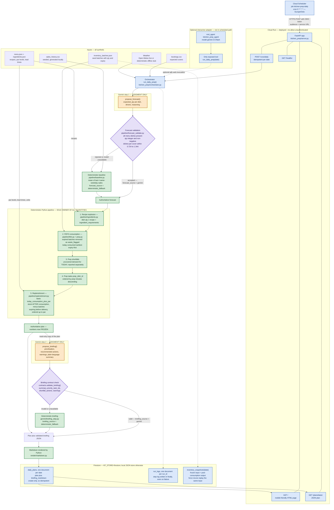

# Architecture — Kitchen Prep Agent

## The rule that shapes the whole system

**Gemini provides judgment. Deterministic Python owns every number.**

The scheduled production pipeline calls Gemini exactly twice per run through the
Google Gen AI SDK, at two controlled, schema-bounded points. Neither call is
allowed to become the source of an authoritative quantity. The optional ADK
developer adapter is a separate interactive entry point and is not used by
Cloud Scheduler.

| Gemini may | Gemini may never |
| --- | --- |
| Propose a per-dish demand forecast, with drivers and reasoning | Have that proposal used unvalidated — every field is checked, and a rejected forecast is replaced by a deterministic baseline |
| Prioritise prep tasks and explain the day | Compute ingredient requirements, FEFO consumption, shortfalls or order quantities |
| Write the morning summary, warnings and recommended actions | Emit the published document directly — Python renders Markdown from validated JSON |
| Flag that something needs a human decision | Approve a menu or portion change itself |

Every value that a cook or a supplier acts on — `ingredient_requirements`,
`fefo_consumption`, `prep_shortfalls`, `replenishment_orders`, `waste_flagged`,
`remaining_stock` — is produced by deterministic Python and handed to Gemini
**read-only**.

## System diagram

Legend — **orange**: Gemini, judgment only, never arithmetic. **green**:
deterministic Python, owner of all authoritative quantities. **purple**:
validation gate with a deterministic fallback. **blue**: infrastructure,
transport and storage.

## Where the boundary is enforced in code

| Boundary | Enforced by |
| --- | --- |
| Production model calls are limited to two schema-bounded operations | `kitchen_prep/gemini/client.py` — Google Gen AI SDK calls only `propose_forecast` and `propose_briefing` |
| The optional ADK adapter exposes only one tool | `kitchen_prep/agent.py` — `tools=[run_daily_prep]`; it is not in the scheduled production path |
| A proposed forecast cannot enter the pipeline unchecked | `kitchen_prep/pipeline/forecast_validate.py` raises `ForecastRejected`; the orchestrator substitutes `baseline_forecast()` |
| The model cannot silently break the run | `kitchen_prep/gemini/client.py` — only 408/429/5xx/network map to `GeminiUnavailable`; 400/401/403/404 crash rather than degrade quietly |
| The briefing cannot change the plan's shape | `kitchen_prep/contracts.py` — `validate_briefing()` |
| The published document is not raw model output | `kitchen_prep/render/markdown.py` renders Markdown from validated JSON |
| A retried trigger cannot create a second plan | `plan_exists()` check plus create-only write of `daily_plans/{date}` |
| A failed run is still auditable | `append_run_log()` in the orchestrator's `finally` block |

### Storage status, stated precisely

`daily_plans`, `run_logs` and `inventory_snapshots` are written through either
backend (`LocalJsonStore` for local development, `FirestoreStore` when
`KP_STORE=firestore`). The first inventory date starts from the synthetic seed.
For each later date, the store freezes the latest earlier output plus orders due
that day as dated FEFO input batches. Forced reruns reuse the frozen input rather
than receiving or consuming twice. Pending orders count toward stock at their
delivery date, preventing duplicate replenishment. An explicit
`KP_INVENTORY_EPOCH` can start a fresh, auditable synthetic par-stock chain
without rewriting older plans; physical receiving discrepancies remain outside
the demo scope.

## Request flow, end to end

1. **07:00 Europe/Oslo** — Cloud Scheduler fires `kitchen-prep-daily` and POSTs
   `{}` to `<service-url>/runs/daily` with an OIDC token whose audience is the
   service URL. Cloud Run runs `--no-allow-unauthenticated`, so only the invoker
   service account gets through.
2. **Idempotency check** — the orchestrator resolves the run date server-side in
   Europe/Oslo and returns the existing plan if `daily_plans/{date}` already
   exists. Scheduler retries are therefore side-effect free.
3. **Inputs** — expected covers from bookings; weather from Open-Meteo, or the
   deterministic offline stub when no API key is configured.
4. **Gemini step 1 via Google Gen AI SDK** — a demand forecast is proposed, then validated. Anything
   outside the contract falls back to the same-weekday baseline, and the plan
   records which path was taken in `forecast_source`.
5. **Yield conversion** — recipe quantities are prepared weight, so each
   ingredient requirement is divided by that ingredient's yield factor to get the
   purchased quantity FEFO, shortfalls and orders all work in. The difference is
   published as trim loss.
6. **Physical corrections** — recorded goods receipts and stock counts for this
   date are applied while the day's inventory input is frozen, so the plan is
   built on what the kitchen actually has rather than on what was ordered.
7. **Deterministic core** — FEFO consumption of today's purchased requirements,
   prep shortfalls, dish and station task ordering, then replenishment to par
   from what is genuinely left.
8. **Gemini step 2 via Google Gen AI SDK** — the frozen plan is handed to the model, which returns a
   prioritisation and briefing in a fixed JSON shape. Invalid or unavailable
   output falls back to a deterministic briefing built from the same plan.
9. **Publish** — Python renders Markdown, the plan is stored, and the run log is
   appended whether the run succeeded or failed.
10. **Consumption** — the kitchen opens `GET /` on a phone; other systems read
   `GET /plans/latest`.

## Yield: prepared weight is not purchased weight

A recipe says `potato_fresh: 0.25` per portion. Nothing in that number says
whether it means 250 g of whole potato or 250 g of peeled potato, and the two
differ by about a fifth. `menu.json` therefore declares `recipe_basis:
"prepared"` — recipe quantities are what reaches the plate — and every ingredient
declares a `yield_factor`, the usable fraction of one purchased unit.

    purchased = prepared / yield_factor
    trim_loss = purchased - prepared

The purchased figure is the authoritative one, because everything downstream
works in purchased units: batches hold purchased stock, shortfalls compare
against purchased stock, par levels and supplier orders are purchased units.

Two properties matter here:

**A missing factor is refused, not defaulted.** `yield_factor()` raises
`YieldUnavailable` for an unknown ingredient, a missing factor, a non-numeric
one, or one outside `(0, 1]`. A silent default of 1.0 would be the dangerous
choice: it looks correct and under-orders forever. `scripts/verify_data.py`
checks every ingredient, so the failure is caught before a run.

**Trim loss is its own category.** It is planned and unavoidable; an expired
batch is neither, and a kitchen acts on the two completely differently. They are
separate fields on the plan and separate sections on the dashboard, never one
merged number.

## Prep on two axes

A dish task — *17 portions of ribs, 68 minutes* — is what a manager reads. It is
the wrong axis for a cook. BBQ sauce goes into ribs and wings: one pot, not two
jobs. Tomato goes into four of the six dishes, so "cut tomatoes" would otherwise
be spread across four dish tasks that nobody can stand at a board and work from.

So prep is described twice, from the same numbers:

| Axis | Built by | What it answers |
| --- | --- | --- |
| Dish assembly | `build_prep_tasks` | How many portions of each dish, and how long assembly takes |
| Component prep | `build_station_tasks` | What each station must produce, aggregated across every dish that uses it |

A station task carries two quantities, because they are different numbers and a
cook needs both: `prepare_qty` is what must exist when prep is finished,
`draw_qty` is what to pull from the walk-in to get there. The gap between them is
the yield.

Labour is costed on `draw_qty`, not on `prepare_qty` — a cook peels the potatoes
picked up, not the ones that survive peeling.

**Stations are data, not code.** They come from the ingredient master, so adding
a bakery is a data change. `config.STATION_LABELS` holds display names only, and
an ingredient naming an unlabelled station still produces a task, named from its
id: a missing label must never silently remove work from the prep list.
`scripts/verify_data.py` refuses a half-declared station — one without an action,
or without a rate — because that produces a task nobody can act on.

## Physical corrections: goods receipt and stock count

Two assumptions would otherwise compound down the snapshot chain: that every
order arrives in full on its delivery date, and that theoretical FEFO
consumption is what physically happened. `pipeline/receiving.py` corrects both
from recorded events, and owns no arithmetic the kitchen cannot check.

| Event | What it means | What it does |
| --- | --- | --- |
| `receipt` | What a delivery actually contained | Replaces the assumed arrival batch `delivery-<order date>-<item>`, so a partial or missing delivery reduces stock instead of inflating it |
| `count` | What a physical count actually found | Reconciles the item's batches to the counted quantity: a shortage is removed earliest-expiry-first, a surplus is added at the item's latest known expiry |

Four properties make this safe to leave running:

**Corrections are applied once, while the input is frozen.** They are never
replayed over an existing snapshot, so a forced rerun of a corrected day reuses
the same input and cannot double-apply anything.

**A planned day is never rewritten.** `resolve_effective_date` rolls an event
forward to the first date whose inventory input is not yet frozen. A delivery
logged at 10:00 changes tomorrow's plan, not the plan the kitchen is working
from right now.

**Receipts are applied before counts.** A count therefore reconciles
post-delivery stock, which is what the person counting was looking at.

**Nothing is silently absorbed.** Every difference between expected and actual
is published on the plan as a `stock_variance` and shown on the dashboard, and
the append-only adjustment log records who entered it and when.

## Public interactive sandbox

`GET /demo` is deliberately outside the production flow above. A visitor creates
a random, expiring in-memory session, then the server executes the real
deterministic baseline, recipe explosion, FEFO consumption and replenishment
functions against a controlled synthetic 139-cover scenario. Server-Sent Events
expose each completed tool step. The state machine pauses at
`awaiting_decision`; approve creates a simulated order and moves to
`mitigation_scheduled`, while reject moves to `rejected`.

The sandbox imports neither the production orchestrator nor the private server.
It does not write Firestore, receive a Gemini secret, update inventory or contact
a supplier. Sessions expire after fifteen minutes and the Cloud Run viewer is
limited to one instance so a 90-second interaction stays on the same process.

## Data note

All restaurant names, menu data, recipes, sales history, bookings and inventory
values in this repository are **synthetic and generic**. No real restaurant,
supplier or customer data is used anywhere in the project.
